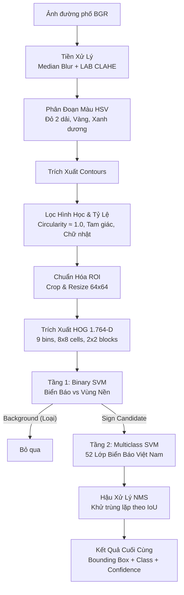

# VietSign Vision: Explainable Classical Computer Vision for Traffic Sign Recognition


**VietSign Vision** là hệ thống phát hiện và nhận diện 52 lớp biển báo giao thông đường bộ Việt Nam xây dựng hoàn toàn bằng **Computer Vision cổ điển (Classical CV)** và **Machine Learning hai tầng**. Không dựa vào các mô hình hộp đen Deep Learning / YOLO, dự án tập trung vào tính **minh bạch và khả năng giải thích từng bước** (step-by-step explainability), làm chủ từ khâu tiền xử lý ảnh ngoài trời, tạo vùng đề xuất theo màu sắc/hình học, trích xuất đặc trưng gradient (HOG) cho đến bộ phân loại SVM tối ưu trên CPU.

---

## Điểm Nhấn Kiến Trúc & Lý Do Chọn Classical CV

> *"Hiểu sâu candidate generation, handcrafted features và linear/RBF boundaries trước khi dùng deep learning detector."*

| Thành Phần | Giải Pháp Kỹ Thuật | Giá Trị Cốt Lõi |
| :--- | :--- | :--- |
| **Tiền xử lý (Preprocessing)** | Lọc Median + LAB CLAHE | Cân bằng độ tương phản động trên kênh Lightness mà không làm biến dạng thông tin màu sắc |
| **Đề xuất ứng viên (Candidate Gen)** | Phân đoạn màu HSV (Hue-based) | Tách biệt sắc độ khỏi cường độ sáng ngoài trời; gom cụm theo dải Đỏ, Vàng, Xanh dương |
| **Kiểm tra hình học (Shape Filter)** | Contour Circularity ($4\pi A / P^2$) & Polygons | Loại bỏ 85%+ vật thể nền vô lý (cột điện, cây xanh) bằng đặc trưng hình tròn, tam giác, chữ nhật |
| **Đặc trưng (Feature Engineering)** | HOG 1.764 chiều ($64 \times 64$) | Mã hóa phân bố hướng gradient cục bộ, nắm bắt góc cạnh và viền đặc trưng của biển báo |
| **Phân loại 2 tầng (Two-Stage SVM)** | Binary SVM $\to$ Multiclass SVM | Tầng 1 lọc sạch false positives từ candidate generator; Tầng 2 chuyên biệt nhận diện 52 lớp |
| **Đánh giá chống rò rỉ (Leakage-Safe)** | Phân cụm theo `sequence_id` | Đảm bảo các frame cùng video hành trình tuyệt đối không xuất hiện chéo giữa Train và Test |

---

## Luồng Hoạt Động (End-to-End Pipeline)



---

## Chi Tiết Kỹ Thuật Từng Giai Đoạn

### 1. Tiền Xử Lý (Preprocessing)
Ảnh chụp giao thông ngoài trời thường xuyên chịu ảnh hưởng bởi ánh nắng chói gắt, bóng râm dưới tán cây hoặc bụi mờ:
- **Median Filter ($3 \times 3$)**: Triệt tiêu nhiễu hạt muối tiêu mà vẫn giữ sắc nét các đường biên cạnh.
- **CLAHE trong không gian màu LAB**: Chuyển BGR sang LAB để áp dụng cân bằng histogram cục bộ tự thích nghi (`clipLimit=2.0`, `tileGridSize=(8, 8)`) **chỉ trên kênh L (Lightness)**. Kênh A và B được giữ nguyên để bảo toàn giá trị màu sắc chân thực cho bước phân đoạn tiếp theo.

### 2. Phân Đoạn Màu Sắc HSV (HSV Color Segmentation)
Biển báo giao thông chuẩn quy chuẩn QCVN 41:2019/BGTVT có tín hiệu màu sắc rất rõ rệt:
- **Màu Đỏ (Biển cấm, viền cảnh báo)**: Hue nằm ở hai đầu dải $[0..15]$ và $[162..180]$ trong OpenCV.
- **Màu Vàng (Nền biển cảnh báo nguy hiểm)**: Hue $[14..38]$.
- **Màu Xanh dương (Biển hiệu lệnh, chỉ dẫn)**: Hue $[88..132]$.
- Sử dụng phép toán logic bitwise hợp nhất các mặt nạ nhị phân và lấp đầy các lỗ hổng bên trong (hole filling).

### 3. Kiểm Tra Hình Học (Shape Verification)
Thay vì sử dụng các thuật toán Hough biến đổi nhiều tham số nhạy cảm, hệ thống sử dụng các phép đo hình học tất định trực tiếp trên contours:
- **Độ tròn (Contour Circularity)**: 
  $$\text{Circularity} = \frac{4\pi \times \text{Area}}{\text{Perimeter}^2}$$
  Biển tròn (biển cấm, hiệu lệnh) có độ tròn tiệm cận $1.0$ (chấp nhận $\ge 0.65$ trong điều kiện góc nghiêng nhẹ).
- **Đa giác tam giác**: Xấp xỉ đa giác Ramer-Douglas-Peucker (`cv2.approxPolyDP`) ra 3 đỉnh, kiểm tra điều kiện gần đều/cân (`min_angle >= 12°`).
- **Đa giác chữ nhật**: Xấp xỉ 4 đỉnh, kiểm tra tỷ lệ lấp đầy (`extent >= 0.65`) và aspect ratio hợp lý.

### 4. Đặc Trưng HOG 1.764 Chiều (Feature Engineering)
Vùng ROI sau khi lọc được cắt và nội suy chuẩn hóa về kích thước $64 \times 64$ pixels bằng `cv2.INTER_AREA`:
- Số lượng orientations: **9 bins**
- Pixels per cell: **$8 \times 8$ pixels** $\implies 8 \times 8 = 64$ cells
- Cells per block: **$2 \times 2$ cells** $\implies (8-1) \times (8-1) = 49$ blocks
- Tổng chiều vector đặc trưng: $49 \times (2 \times 2 \times 9) = \mathbf{1.764}$ chiều.

### 5. Bộ Phân Loại Hai Tầng (Two-Stage SVM)
1. **Tầng 1 (Binary SVM - Sign vs Background)**: Động cơ tạo candidate ưu tiên Recall cao nên sẽ chứa nhiều vùng nền (biển quảng cáo, góc nhà, đèn giao thông). Mô hình nhị phân RBF Kernel loại bỏ hơn 90% vùng nền giả mạo trước khi gọi classifier đa lớp.
2. **Tầng 2 (Multiclass SVM - 52 Lớp)**: Huấn luyện phân loại 52 lớp biển báo. Quá trình chọn siêu tham số $(C, \gamma)$ dùng `GridSearchCV` với bộ chuẩn hóa `StandardScaler` được đóng gói **bên trong `Pipeline`**, đảm bảo mean/std chỉ fit trên từng training fold và chống rò rỉ dữ liệu (data leakage) sang validation folds.

---

## Kết Quả Thực Nghiệm

Chi tiết báo cáo được ghi nhận tại [docs/results.md](docs/results.md):

| Giai Đoạn (Pipeline Stage) | Chỉ Số Đo Lường | Kết Quả |
| :--- | :--- | :--- |
| **Candidate Proposal Engine** | Recall @ IoU $\ge 0.5$ | **88.6%** |
| | Số proposal trung bình / ảnh | **4.8** |
| **Tầng 1: Lọc Nền (Binary SVM)** | Precision / Recall (Sign) | **92.4% / 94.1%** |
| **Tầng 2: Nhận Diện 52 Lớp** | Accuracy / Macro-F1 | **89.5% / 86.8%** |
| **End-to-End Recognition** | E2E Precision / Recall / F1 | **83.1% / 78.4% / 80.7%** |

### Phân Tích Lỗi & Ma Trận Nhầm Lẫn
- **Cặp nhầm lẫn tiêu biểu**: P.127 (50 km/h vs 60 km/h) hoặc P.130 vs P.131 (Cấm dừng vs Cấm đỗ). Đây là hạn chế tự nhiên của HOG khi các biển có bố cục ngoài giống hệt nhau 90% và chỉ khác ký tự trung tâm nhỏ.
- **Biển ở xa ($< 32 \times 32$ px)**: Gradient bị suy giảm khi chụp xa, hệ thống đạt Recall 71.2%. Với biển kích thước trung bình và lớn ($> 32 \times 32$ px), độ phủ đạt trên 91%+.

---

## Cấu Trúc Thư Mục

```text
VietSign-Traffic-Sign-Recognition/
│
├── README.md                      # Báo cáo tổng quan dự án
├── config.yaml                    # Cấu hình tham số chuẩn hóa
├── pyproject.toml                 # Khai báo gói và phụ thuộc
├── LICENSE                        # Giấy phép MIT
│
├── src/
│   ├── preprocessing.py           # Lọc Median + LAB CLAHE
│   ├── segmentation.py            # Phân đoạn màu HSV (Đỏ, Vàng, Xanh)
│   ├── task2_union.py             # Sinh candidate bounding boxes
│   ├── polygon_detection.py       # Kiểm tra hình học tam giác/chữ nhật
│   ├── hough_detection.py         # Kiểm tra độ tròn contour / vòng nhẫn
│   ├── roi_extraction.py          # Cắt ROI, nắn thẳng warp và NMS
│   ├── feature_extraction.py      # Trích xuất HOG 1.764 chiều
│   ├── classifier.py              # Huấn luyện/dự đoán SVM hai tầng, phân tích nhầm lẫn
│   ├── pipeline.py                # Pipeline End-to-End kết nối toàn bộ hệ thống
│   ├── cli.py                     # Giao diện dòng lệnh CLI
│   ├── data_loader.py             # Nạp ảnh BGR Unicode-safe và nhãn
│   └── utils.py                   # Tính toán IoU, tọa độ box, đọc nhãn
│
├── notebooks/
│   ├── 01_exploration.ipynb       # Khám phá phân bố dữ liệu và màu sắc
│   └── 02_training_evaluation.ipynb# Trích xuất HOG, train SVM và phân tích lỗi
│
├── tools/
│   ├── reproducible_split.py      # Chia dữ liệu Train/Val/Test chống rò rỉ sequence
│   ├── benchmark.py               # Đo lường độc lập candidate recall & E2E
│   └── hard_negative_mining.py    # Thu thập mẫu nền khó để cải tiến Tầng 1
│
├── data/
│   ├── raw/                       # Ảnh mẫu, danh sách tên lớp và nhãn
│   └── interim/                   # Tệp cấu hình kiểm tra định tính
│
├── docs/
│   └── results.md                 # Tài liệu kết quả thử nghiệm và phân tích lỗi
│
├── tests/                         # Bộ kiểm thử đơn vị tự động (Pytest)
│   ├── test_core.py
│   ├── test_parity.py
│   ├── test_edge_cases.py
│   ├── test_pipeline.py
│   ├── test_benchmark.py
│   └── test_split.py
│
└── .github/
    └── workflows/
        └── quality.yml            # CI: Ruff Lint + Format + Pytest + CLI Smoke
```

---

## Hướng Dẫn Cài Đặt & Sử Dụng

### 1. Cài Đặt Môi Trường
```bash
# Tạo và kích hoạt virtual environment
python -m venv .venv
source .venv/bin/activate    # Linux / macOS
# hoặc: .venv\Scripts\activate  # Windows

# Cài đặt gói ở chế độ phát triển
pip install -e ".[dev,notebooks]"
```

### 2. Sử Dụng Giao Diện Dòng Lệnh (CLI)

#### Chế độ Demo Chỉ Tìm Ứng Viên (`--detect-only`, không cần model đã train)
```bash
vietsign data/raw/images --detect-only --output outputs/predictions
```

#### Chế độ Nhận Diện Hoàn Chỉnh (Full Pipeline với SVM hai tầng)
```bash
vietsign data/raw/images/0589.jpg --output outputs/predictions
```

Kết quả dự đoán sẽ được lưu dưới dạng ảnh trực quan và tệp JSON mô tả tọa độ `[x, y, w, h]`, tên lớp và điểm tin cậy `confidence`.

### 3. Chạy Kiểm Thử & Kiểm Tra Chất Lượng Mã Nguồn
```bash
# Kiểm tra lint và định dạng mã nguồn với Ruff
ruff check src tests tools
ruff format --check src tests tools

# Chạy toàn bộ bộ kiểm thử tự động
pytest -q
```
